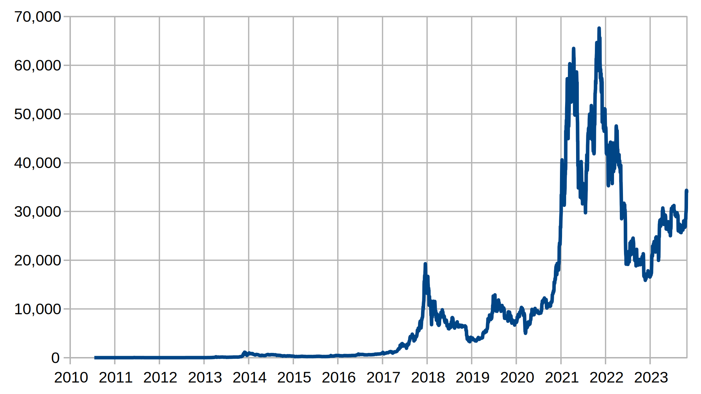

# Kursentwicklung

Am 22. Mai 2010 wurde Bitcoin zum ersten Mal für eine Transaktion von Geld
verwendet. Laszlo Hanyecz hat zwei Pizzen mit 10'000 BTC bezahlt. Im Februar
2011 erreichte Bitcoin zum ersten Mal die Parität zum Dollar. Bereits im Juni
des gleichen Jahres wurde ein Bitcoin zu 10 USD gehandelt. Danach dauerte es
allerdings beinahe 2 Jahre bis im April 2013 die Grenze von 100 USD durchbrochen
wurde. Der Aufschwung führte dazu, dass bereits im November ein Wechselkurs von
1000 USD zu 1 BTC erreicht wurde.

Danach dauerte es allerdings bis März 2017, bis der Höchststand von 2013
erreicht wurde. Anschliessend stieg der bis im November 2017 auf über 10'000
USD. Am 17. Dezember 2017 wurde das damalige Allzeithoch von 19'783 USD erzielt.
Die Freude währte aber nur kurz. Bereits am 22. Dezember verlor Bitcoin allerdings
innerhalb von 24h beinahe ein Drittel des Wertes und notierte bei unter 14'000
USD.

Bis in den Dezember 2018 sollte Bitcoin noch bis auf 3'300 USD abstürzen.
Während er im Juli 2019 auf über 10'000 USD stieg, sank der Wert im März 2020
auf 5000 USD. Bis zu Beginn des nächsten Jahres sollte der Kurs auf über 40'000
USD steigen. Bis in den Februar war der Kurs starken Schwankungen unterworfen,
ehe der Kurs bis zum 14. April 2021 auf ein neues Allzeithoch ($64'800) stieg.
Anschliesend sank er bis zum 19. Mai wieder auf ca. 30'000 USD. Bereits im
September stiegt der Kurs allerdings wieder auf über 50'000 Dollar. Am 20.
Oktober 2021 erzielte Bitcoin das Allzeithoch von $66,975.

Seither ist der Kurs gesunken und bewegt sich zwischen 16'216 USD und ca. 35'000
US-Dollar. Der Kurs ist weiterhin erheblichen Schwankungen ausgesetzt.
