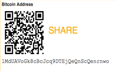

# Wie bezahlt man mit Bitcoin in einem Webshop?

Es ist einfach, mit Bitcoin in einem Webshop zu bezahlen. Hier ist eine Schritt-für-Schritt-Anleitung, die Ihnen zeigt, wie es funktioniert:

## Schritt 1: Produktauswahl

Beginnen Sie damit, die Produkte auszuwählen, die Sie kaufen möchten. Legen Sie sie in Ihren Warenkorb und gehen Sie zur Kasse.

## Schritt 2: Wählen Sie Bitcoin als Zahlungsmethode

Im Zahlungsbereich des Webshops sollten verschiedene Zahlungsoptionen angezeigt werden. Wählen Sie "Bitcoin" aus der Liste der akzeptierten Zahlungsmethoden.

## Schritt 3: Generieren Sie eine Zahlungsadresse

Sobald Sie Bitcoin als Zahlungsmethode ausgewählt haben, wird der Webshop Ihnen eine Bitcoin-Adresse und den zu zahlenden Betrag in Bitcoin anzeigen.

:::warning
Stellen Sie sicher, dass Sie die angezeigte Bitcoin-Adresse korrekt übertragen, um sicherzustellen, dass Ihre Zahlung ordnungsgemäß verarbeitet wird.

:::

## Schritt 4: Öffnen Sie Ihre Bitcoin-Wallet

Öffnen Sie Ihre Bitcoin-Wallet-App oder -Software. Wählen Sie die Option zur Überweisung oder zum Senden von Bitcoin.

## Schritt 5: Geben Sie die Zahlungsadresse ein

Kopieren Sie die Bitcoin-Adresse aus dem Webshop und fügen Sie sie in das Feld "Empfängeradresse" in Ihrer Wallet ein. Geben Sie den zu zahlenden Betrag in Bitcoin ein.

## Schritt 6: Bestätigen Sie die Transaktion

Überprüfen Sie die eingegebene Adresse und den Betrag, um sicherzustellen, dass alles korrekt ist. Bestätigen Sie dann die Transaktion.

:::info
Bitcoin-Transaktionen sind nicht nich rückgängig machbar. Stellen Sie sicher, dass alle Angaben korrekt sind, bevor Sie die Transaktion bestätigen..

:::

## Schritt 7: Warten Sie auf die Bestätigung

Sobald die Transaktion abgeschickt ist, müssen Sie möglicherweise eine kurze Zeit warten, bis sie in die Blockchain aufgenommen und bestätigt wird.

## Schritt 8: Bestellbestätigung erhalten

Sobald die Transaktion bestätigt ist, wird der Webshop eine Bestellbestätigung senden, und Ihre Bestellung wird bearbeitet.

---

:::note
Jeder Webshop kann etwas unterschiedlich sein, aber dieser allgemeine Ablauf sollte in den meisten Fällen gelten.

:::

**Beispiel-Webshop:**

Für ein Beispiel eines Webshops, der Bitcoin akzeptiert, besuchen Sie [CryptoMart](https://cryptomart.com).
