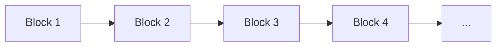
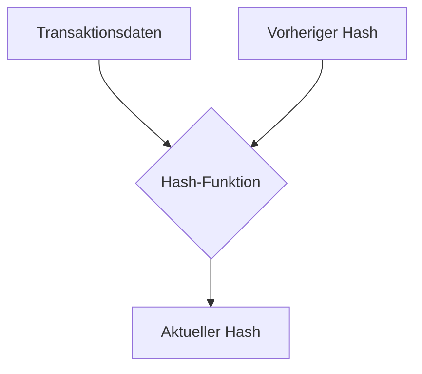

# Wie funktioniert die Blockchain?

## Einführung

Die Blockchain-Technologie ist das Rückgrat von Kryptowährungen wie Bitcoin. In
diesem Artikel werden wir die grundlegenden Konzepte und Funktionsweisen einer
Blockchain diskutieren.

## Was ist eine Blockchain?

Eine Blockchain ist eine verteilte Datenbank, die aus einer Kette von Blöcken
besteht. Jeder Block enthält eine Liste von Transaktionen. Diese Blöcke sind
durch kryptographische Hashes miteinander verknüpft.

## Wie Blöcke funktionieren

Ein Block in einer Blockchain enthält die folgenden Hauptelemente:

- **Transaktionsdaten**: Eine Liste der Transaktionen im Block.
- **Vorheriger Hash**: Der kryptographische Hash des vorherigen Blocks in der
  Kette.
- **Hash**: Der kryptographische Hash des aktuellen Blocks.

### Kryptographische Hash-Funktion

Ein wichtiger Aspekt der Blockchain ist die Verwendung einer kryptographischen
Hash-Funktion, meistens SHA-256 im Fall von Bitcoin. Diese Funktion nimmt die
Transaktionsdaten und den vorherigen Hash als Eingabe und erzeugt einen
eindeutigen Hash-Wert.

## Verteiltes Netzwerk

Die Blockchain wird auf mehreren Knoten (Computern) im Netzwerk gespeichert.
Jeder Knoten hat eine Kopie der gesamten Blockchain. Das sorgt für Transparenz
und Sicherheit.

## Konsensalgorithmus

Damit Transaktionen hinzugefügt werden können, muss das Netzwerk einen Konsens
finden. In der Bitcoin-Blockchain wird dazu der Proof-of-Work (PoW) Algorithmus
verwendet.

## Warum ist die Blockchain sicher?

Die Blockchain bietet eine Reihe von Sicherheitsfeatures:

1. **Unveränderbarkeit**: Sobald ein Block erstellt ist, kann er nicht mehr
   verändert werden, ohne alle folgenden Blöcke zu verändern.
2. **Transparenz**: Jeder Knoten im Netzwerk hat eine Kopie der Blockchain, was
   Manipulation erschwert.
3. **Dezentralisierung**: Es gibt keinen zentralen Punkt, der angreifbar wäre.

## Fazit

Die Blockchain ist eine revolutionäre Technologie mit dem Potenzial, nicht nur
die Finanzwelt, sondern viele andere Branchen zu verändern. Durch ihre
dezentrale Natur und ihre Fähigkeit zur Aufrechterhaltung unveränderlicher
Aufzeichnungen bietet sie eine Reihe von Vorteilen gegenüber traditionellen
zentralisierten Systemen.
