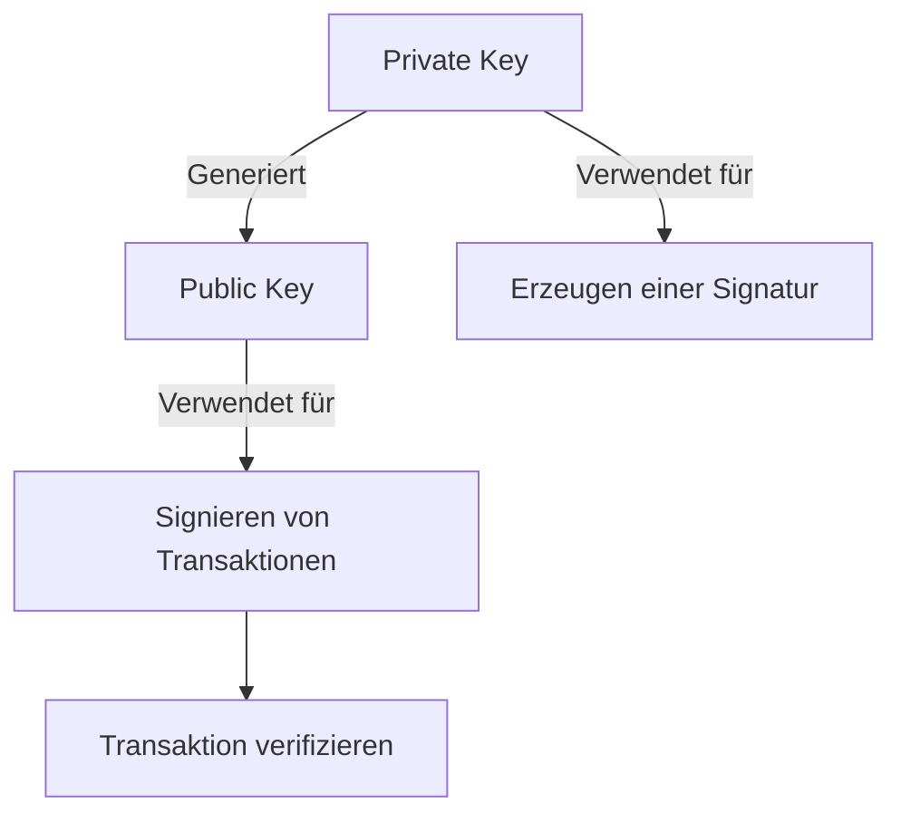

# Was sind Private und Public Keys?

## Einführung

Private und Public Keys sind grundlegende Konzepte in der Kryptographie und
bilden das Herzstück der Sicherheitsmechanismen von Bitcoin. In diesem Artikel
erfährst du, was diese Schlüssel sind und wie sie funktionieren.

## Was ist ein Public Key?

Ein Public Key ist ein kryptographischer Schlüssel, der mit dem Private Key
eines Benutzers verknüpft ist. Er wird verwendet, um Transaktionen zu signieren
und zu verifizieren und ist öffentlich einsehbar.

## Was ist ein Private Key?

Ein Private Key ist ein kryptographischer Schlüssel, der nur dem Eigentümer
bekannt ist. Er wird zur Erstellung einer digitalen Signatur für Transaktionen
verwendet.

## Warum sind Private und Public Keys wichtig?

1. **Sicherheit**: Der Private Key muss geheim gehalten werden und dient als
   Ihre digitale Unterschrift, wodurch die Sicherheit der Transaktion
   gewährleistet ist.
2. **Authentizität**: Durch die Verwendung beider Schlüssel können andere
   Netzwerkteilnehmer die Authentizität einer Transaktion bestätigen.

## Funktionen von Private und Public Keys

- **Signieren von Transaktionen**: Der Private Key wird zum Signieren von
  Transaktionen verwendet, die dann im Netzwerk verteilt werden.
- **Verifizieren von Transaktionen**: Der Public Key wird von anderen im
  Netzwerk verwendet, um die Signatur zu verifizieren.

## Risiken

Der Verlust des Private Keys bedeutet, dass du keinen Zugriff mehr auf deine
Bitcoins hast. Daher ist es äusserst wichtig, Backups deiner Schlüssel zu
erstellen und sie sicher aufzubewahren.

## Fazit

Die Verwendung von Private und Public Keys in Bitcoin bietet eine starke Form
der Authentifizierung und ist ein Kernstück der Sicherheit und Funktionsweise
der Blockchain-Technologie.
