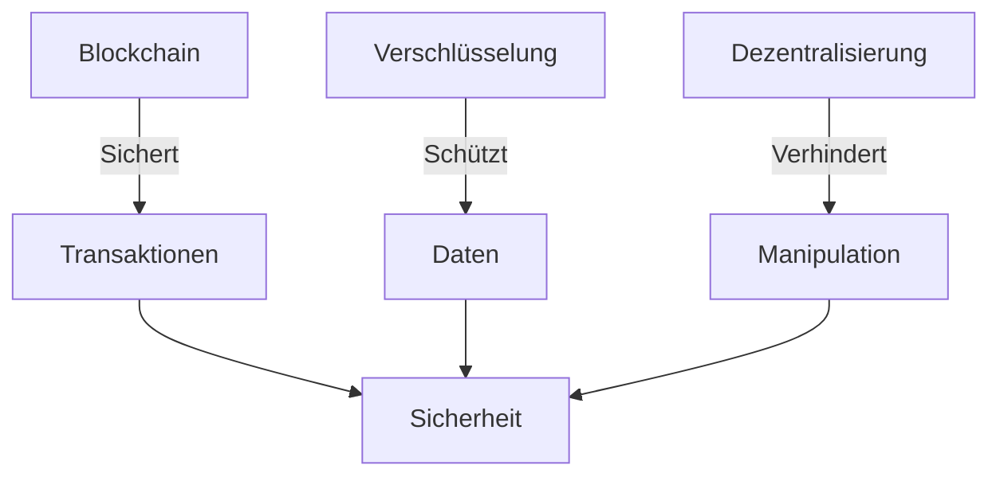

# Sicherheit und Risiken

## Einführung

Während Bitcoin viele innovative Sicherheitsmechanismen bietet, bringt die
Nutzung der Kryptowährung auch bestimmte Risiken mit sich. In diesem Artikel
werden wir die wichtigsten Sicherheitsaspekte sowie potenzielle Gefahren
untersuchen.

## Sicherheitsfeatures von Bitcoin

Bitcoin bietet eine Reihe von Sicherheitsmechanismen, die es zu einer der
sichersten Kryptowährungen machen:

1. **Blockchain-Technologie**: Die Unveränderbarkeit der Blockchain macht es
   schwer, Transaktionen zu manipulieren.
2. **Verschlüsselung**: Durch die Verwendung von Private und Public Keys ist die
   Kommunikation verschlüsselt und sicher.
3. **Dezentralisierung**: Das Fehlen einer zentralen Behörde minimiert das
   Risiko von Manipulation und Kontrolle.

## Risiken und Gefahren

Trotz der hohen Sicherheit birgt die Verwendung von Bitcoin einige Risiken:

1. **Verlust des Private Keys**: Ohne den Private Key hast du keinen Zugang mehr
   zu deinen Coins.
2. **Phishing-Angriffe**: Betrüger könnten versuchen, deine Schlüssel durch
   betrügerische Websites oder Nachrichten zu erlangen.
3. **Marktvolatilität**: Der Wert von Bitcoin kann stark schwanken, was ein
   finanzielles Risiko darstellt.

## Best Practices für mehr Sicherheit

- **Cold Storage**: Lagere einen Grossteil deiner Bitcoins in einer Cold Wallet,
  die nicht mit dem Internet verbunden ist.
- **Zwei-Faktor-Authentifizierung (2FA)**: Aktiviere 2FA für alle Konten, die
  mit deinen Bitcoins in Verbindung stehen.
- **Software-Updates**: Halte deine Wallet-Software und dein Betriebssystem
  immer auf dem neuesten Stand.

## Fazit

Obwohl Bitcoin viele Sicherheitsfeatures bietet, ist es wichtig, sich der damit
verbundenen Risiken bewusst zu sein und geeignete Sicherheitsmassnahmen zu
treffen.
